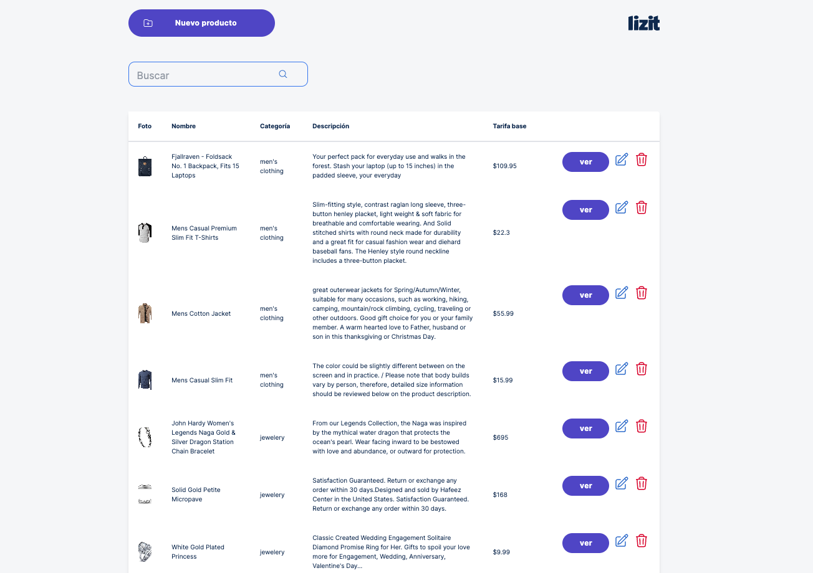

## Como probar en local

1. git clone
2. instalacion de dependencias: yarn, npm, pnpm
3. 

```bash
npm run dev
# or
yarn dev
# or
pnpm dev
# or
bun dev
```

# Test Frontend Daniel Suarez

Se crea el proyecto con las siguientes tecnologias:

- Nextjs
- Tailwind
- ContextApi

Para sacar provecho de nextjs hice un fetch con SSR y de resto lo hice del lado del cliente, para persistir los datos use localstorage por comodidad para poder tener un flujo mas amigable.

